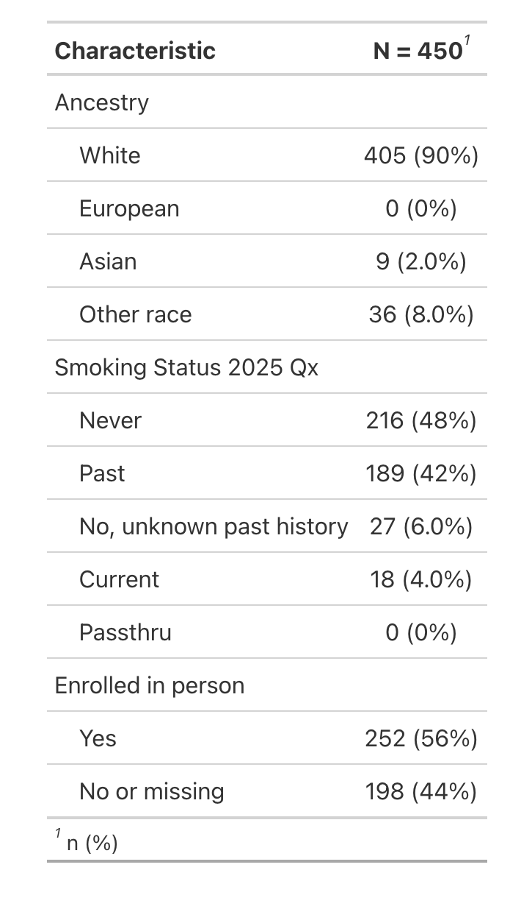

<!-- README.md is generated from README.Rmd. Please edit that file -->

```{r, include = FALSE}
knitr::opts_chunk$set(
  collapse = TRUE,
  comment = "#>",
  fig.path = "man/figures/README-",
  out.width = "100%"
)
```

# fixer

<!-- badges: start -->
<!-- badges: end -->

Some fixed-width files (fwf) are created with a complementary data dictionary. Such dictionaries contain metadata such as column widths, variable types, and variable labels. The `{fixer}` package reads fixed-width files according to their data dictionary. 

## Installation

You can install the development version of fixer like so:

``` r
devtools::install_github("tgerke/fixer")
```

## Read a fixed width file according to its data dictionary 

```{r example, message = FALSE}
library(fixer)

dd <- fwiffer:::read_fwf_example("example-fwf-dictionary.dd") |> 
  read_dd(skip = 2)

fwf_data <- fixer:::read_fwf_example("example-fwf-data.dat") |>
  read_fwf_dd(dd)

fwf_data
```

Note that variable labels are retained as well:

```{r show-labels, echo=TRUE, results='hide'}
library(gtsummary)

fwf_data %>%
  select(racebld, smokebld, fastbld) %>%
  tbl_summary()
```

```{r print-labels, out.width = "40%", echo = FALSE, fig.align='center'}

```
