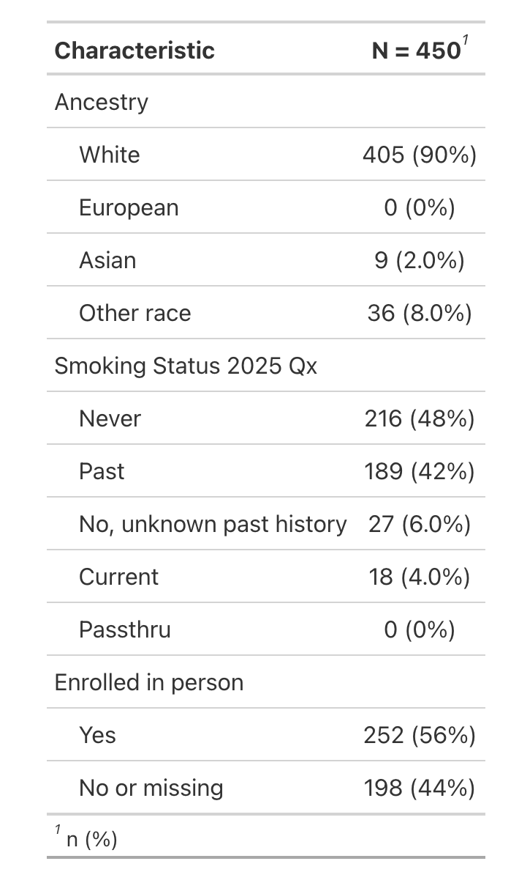

<!-- README.md is generated from README.Rmd. Please edit that file -->

# fixer

<!-- badges: start -->
<!-- badges: end -->

Some fixed-width files (fwf) are created with a complementary data
dictionary. Such dictionaries contain metadata such as column widths,
variable types, and variable labels. The `{fixer}` package reads
fixed-width files according to their data dictionary.

## Installation

You can install the development version of fixer like so:

``` r
devtools::install_github("tgerke/fixer")
```

## Read a fixed width file according to its data dictionary

``` r
library(fixer)

dd <- fwiffer:::read_fwf_example("example-fwf-dictionary.dd") |> 
  read_dd(skip = 2)

fwf_data <- fixer:::read_fwf_example("example-fwf-data.dat") |>
  read_fwf_dd(dd)

fwf_data
#> # A tibble: 450 × 13
#>        id    cd racebld yobenr smokebld mnthbld timebld fastbld       prob4bld
#>     <dbl> <dbl> <fct>    <dbl> <fct>      <dbl> <fct>   <fct>         <lgl>   
#>  1 538197    70 White       21 Never       1141 <NA>    No or missing NA      
#>  2 538199    76 White       22 Past        1128 12:00 p No or missing NA      
#>  3 538202    17 White       22 Past        1128 <NA>    No or missing NA      
#>  4 538205    26 White       22 Past        1127 8:00 a  Yes           NA      
#>  5 538307    32 White       22 Past        1127 10:00 a Yes           NA      
#>  6 538227    44 White       21 Past        1129 8:00 a  Yes           NA      
#>  7 538236    44 White       22 Never       1129 12:00 p No or missing NA      
#>  8 538254    42 White       23 Past        1130 <NA>    No or missing NA      
#>  9 538259    63 White       24 Never       1135 10:00 a Yes           NA      
#> 10 538263    54 White       25 Past        1129 10:00 a Yes           NA      
#> # ℹ 440 more rows
#> # ℹ 4 more variables: prob5bld <fct>, prob9bld <lgl>, prob10bld <fct>,
#> #   prob18bld <fct>
```

Note that variable labels are retained as well:

``` r
library(gtsummary)

fwf_data %>%
  select(racebld, smokebld, fastbld) %>%
  tbl_summary()
```


